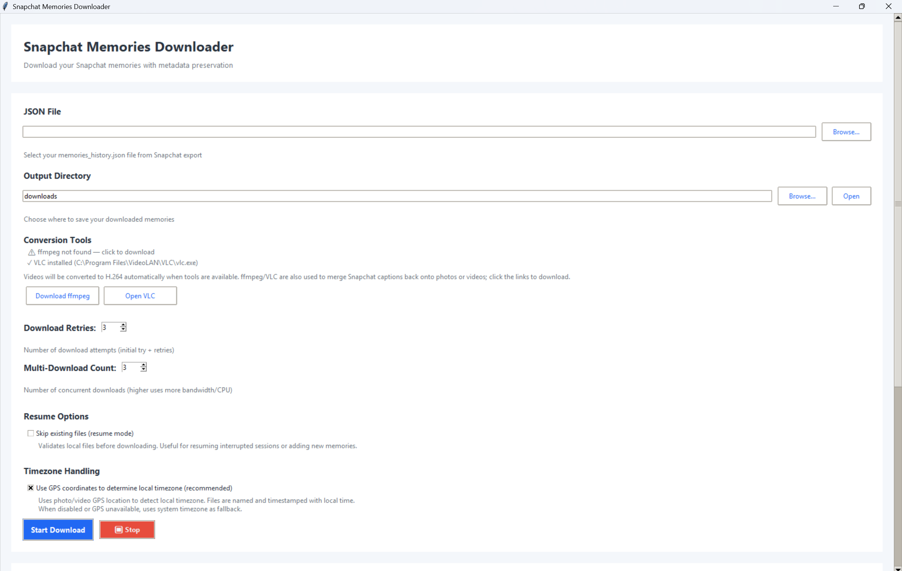
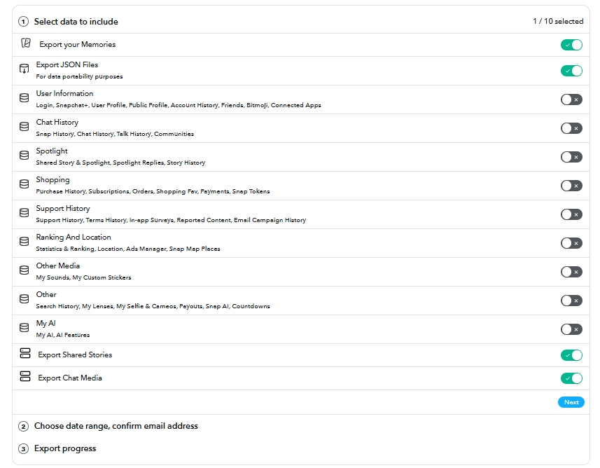
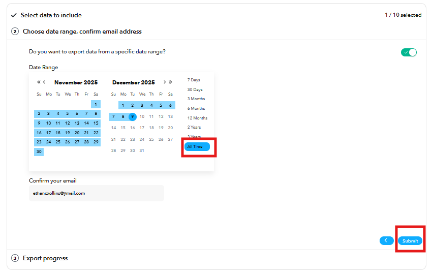
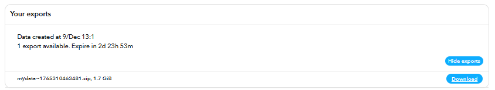
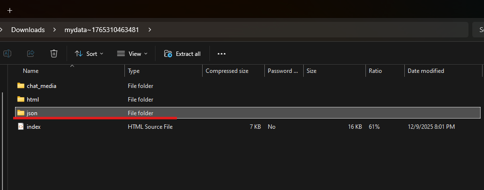
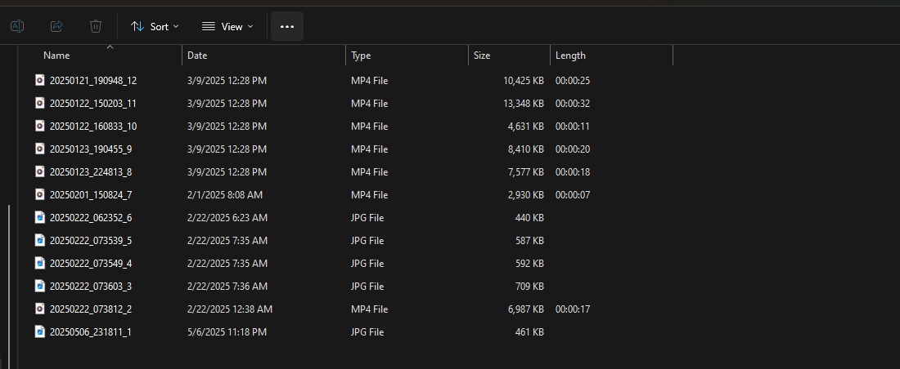
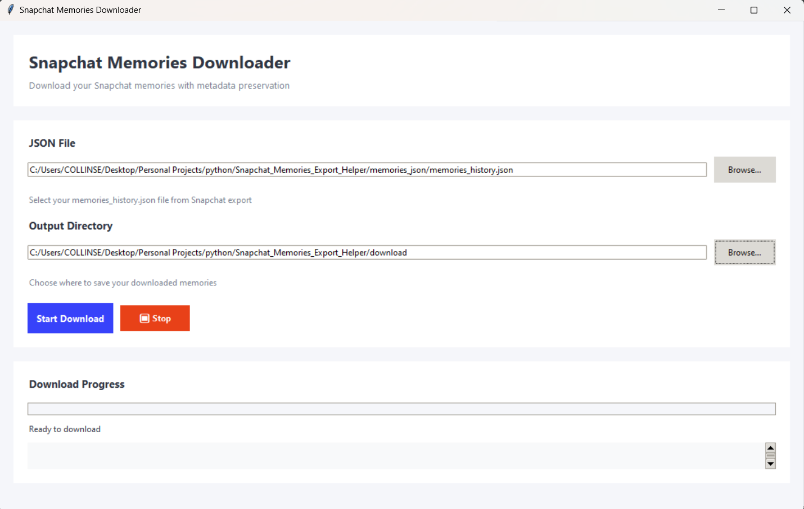
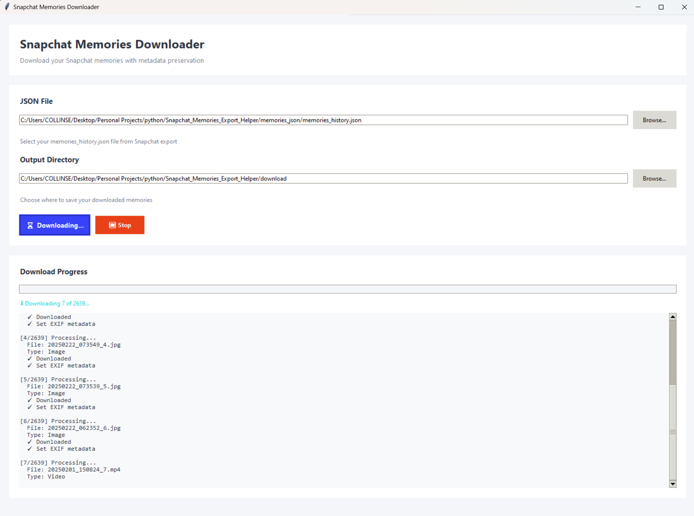

# Snapchat Memories Downloader GUI

A user-friendly Windows desktop application to download and preserve your Snapchat memories with their original metadata, including dates and location information.



## 🚀 Quick Start

**Download the official release executable** — The easiest way to use this tool:

1. **Get the `.exe`** from the [latest release](https://github.com/ethanwheatthin/Snapchat_Memories_Downloader_GUI/releases)
2. **Install recommended tools** (optional but highly recommended):
   - [VLC Media Player](https://www.videolan.org/) — for video format conversion
   - [FFmpeg](https://www.ffmpeg.org/download.html) — for enhanced video overlay merging
3. **Request your Snapchat data** (see instructions below)
4. **Run the app** and select your `memories_history.json` file

> **Note:** Do not download the repository ZIP. Use the pre-built `.exe` from the Releases page for the best experience.

## 📋 Overview

This tool downloads all your Snapchat memories using the `memories_history.json` file from your Snapchat data export. It preserves metadata like creation dates, timestamps, and GPS coordinates by embedding them directly into your downloaded media files. It also automatically merges overlay captions and stickers back onto your photos and videos when present.


## ✨ Features

- **Simple GUI** — No command line needed, just point and click
- **Bulk Download** — Download all your memories at once with retry logic
- **Resume Downloads** — Skip already downloaded files to resume interrupted sessions
- **Overlay Merging** — Automatically merges caption/sticker overlays back onto photos and videos
- **Metadata Preservation** — Embeds original dates and GPS coordinates into EXIF data (images) and file metadata (videos)
- **Video Conversion** — Automatic H.264 conversion for better Windows compatibility (when VLC is installed)
- **File Timestamps** — Sets file modification dates to match memory creation dates
- **Progress Tracking** — Real-time progress updates and detailed logging
- **Stop/Resume** — Pause and resume downloads at any time

## 🚀 Getting Started

### Using the Executable (Recommended)

1. **Download** the latest `.exe` from the [releases page](https://github.com/ethanwheatthin/Snapchat_Memories_Downloader_GUI/releases)
2. **Install optional tools** for best results:
   - **VLC Media Player** ([download](https://www.videolan.org/)) — enables video conversion to H.264
   - **FFmpeg** ([download](https://www.ffmpeg.org/download.html)) — enhances video overlay merging
3. **Run the application** — Double-click the `.exe` file (no installation needed)
4. Follow the usage instructions below

### Running from Source

For developers or advanced users:

```bash
# Clone the repository
git clone https://github.com/ethanwheatthin/Snapchat_Memories_Downloader_GUI.git
cd Snapchat_Memories_Downloader_GUI

# Install dependencies
pip install -r requirements.txt

# Run the application
python download_snapchat_memories_gui.py
```

## 📥 How to Get Your Snapchat Data

1. Open **Snapchat** on your mobile device
2. Tap your **profile icon** (top-left) → **⚙️ Settings** (top-right)
3. Scroll to **Privacy Controls** → Tap **My Data**
4. **Select data to export** — Check the boxes for memories you want:

   

5. **Choose date range** for your memories:

   

6. Tap **Submit Request**:

   

7. **Wait 24-48 hours** for Snapchat to prepare your data
8. **Download the ZIP** when you receive the email from Snapchat
9. **Extract the ZIP** (right-click → "Extract All..." on Windows):

   

10. Locate `memories_history.json` in the extracted folder (usually in the root or `json` subfolder)

## 📖 How to Use

1. **Launch the Application**

   

2. **Select JSON File**
   - Click "Browse..." next to "JSON File"
   - Select your `memories_history.json` file

3. **Choose Output Directory**
   - Click "Browse..." next to "Output Directory"
   - Select where to save memories (default: `downloads` folder)

   
   

4. **Configure Options (Optional)**
   
   **Resume Options:**
   - **Skip existing files (resume mode)** — Enable this to avoid re-downloading files that already exist
     - Useful when resuming after an interruption or adding new memories
     - Validates existing files and only downloads what's missing
     - Also checks for multiple filename patterns (merged overlays, collision-resolved files)
   - **Re-convert existing videos to H.264 if needed** — Only appears when resume mode is enabled
     - Checks codec of existing videos and re-converts non-H.264 videos
     - Helps ensure all videos are compatible with Windows Media Player and other tools
     - Skips videos already in H.264 format to save time
   
   **Timezone Handling:**
   - **Use GPS coordinates to determine local timezone** — Recommended, enabled by default
     - Automatically detects local timezone from photo/video GPS location
     - Files are named and timestamped with local time for easier organization
     - Falls back to system timezone when GPS data is unavailable or checkbox is disabled

5. **Start Download**
   - Click "Start Download"
   - Monitor progress in the log window
   - Click "Stop" to pause if needed

   

6. **Access Your Memories**
   - Files are saved in your output directory
   - Named by creation date: `YYYYMMDD_HHMMSS.jpg` or `YYYYMMDD_HHMMSS.mp4`
   - Overlays are automatically merged when detected

## 🔧 Technical Details

### Supported Media Types

- **Images** — JPEG/JPG with EXIF metadata
- **Videos** — MP4 with embedded metadata

### Metadata Features

- **Timezone-aware timestamps** — Uses GPS coordinates to determine correct local time (falls back to system timezone)
- **Creation date/time preservation** — Embedded in EXIF (images) and file metadata (videos)
- **GPS coordinates** — Embedded when available in original memory
- **Timezone offset tags** — EXIF 2.31 standard offset fields for proper timezone display
- **File modification timestamps** — Match local creation time for correct sorting in file managers
- **Automatic overlay/caption merging** — Combines `-main` and `-overlay` file pairs seamlessly

### Dependencies

Core libraries:
- `requests` — Network downloads
- `Pillow` — Image processing
- `piexif` — EXIF metadata (optional but recommended)
- `mutagen` — Video metadata (optional but recommended)
- `av` (PyAV) — Video processing (optional)
- `python-vlc` — VLC integration (optional)
- `timezonefinder` — GPS-based timezone detection (optional but recommended)
- `pytz` — Timezone handling (optional but recommended)

> **Note:** The application gracefully handles missing optional packages. If timezone libraries aren't installed, timestamps default to UTC. If EXIF/video metadata libraries are missing, files are still downloaded but without embedded metadata.

### Optional Tools

- **VLC Media Player** — Automatic video conversion to H.264 (highly recommended)
- **FFmpeg** — Enhanced video overlay processing

## ⚙️ Building from Source

To compile the executable yourself:

```bash
# Install PyInstaller
pip install pyinstaller

# Use the provided build script
build_exe.bat
```

The executable will be created in the `dist` folder. The build script includes necessary hidden imports for all dependencies.

## 📝 Important Notes

- **Internet Required** — Active connection needed to download from Snapchat servers
- **Storage Space** — Ensure sufficient disk space for all memories
- **URL Expiration** — Download links expire over time; process your data export promptly
- **Privacy** — All processing happens locally on your computer; no data is sent elsewhere
- **Windows Only** — This application is designed specifically for Windows

## 💡 Tips

- **Use Resume Mode** — Enable "Skip existing files" when resuming interrupted downloads
- **Re-convert as needed** — Use the re-conversion option if you have old HEVC videos that won't play properly
- **Download regularly** to avoid URL expiration
- **Organize downloads** by creating subfolders by year/month
- **Verify metadata** by checking a few files after initial download
- **Keep your JSON** — Save a backup copy of `memories_history.json`

## 🤝 Contributing

Contributions welcome! Feel free to:
- Report bugs via [GitHub Issues](https://github.com/ethanwheatthin/Snapchat_Memories_Downloader_GUI/issues)
- Suggest features
- Submit pull requests

## ⚖️ License

This project is provided as-is for personal use. Use responsibly and in accordance with Snapchat's Terms of Service.

## ⚠️ Disclaimer

This tool is not affiliated with, endorsed by, or connected to Snap Inc. or Snapchat. It is an independent utility designed to help users download their own personal data from Snapchat's official data export feature.

---

**Enjoy preserving your Snapchat memories! 📸🎥**
